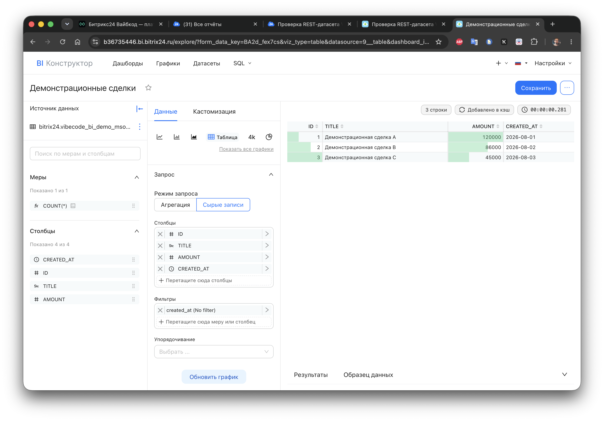
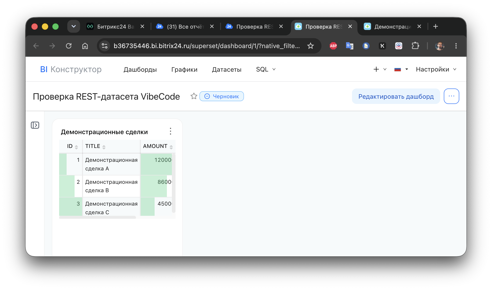

# Проверка API датасетов BI-конструктора

Документация Битрикс24 описывает методы `biconnector.dataset.list`, `get`, `add`, `update`, `delete` и методы для полей датасета. Они требуют scope `biconnector`, коммерческий тариф и доступ пользователя к разделу «Рабочее место аналитика».

## Почему это отдельный сценарий

Встраиваемое приложение получает от Gateway сессию `vibe_session_` для API Вайбкода. Эта сессия не является OAuth-токеном Bitrix24 REST. Проверка `POST /v1/biconnector/dataset/list` у Вайбкода вернула `ROUTE_NOT_FOUND`. Документация Biconnector уточняет дополнительное ограничение: эти методы работают только в контексте приложения. Поэтому входящий вебхук здесь не подходит, нужен OAuth-поток локального приложения Битрикс24.

## Подготовка

1. Создайте локальное приложение Битрикс24 со scope `biconnector`; пользователь OAuth-токена должен иметь доступ к «Рабочему месту аналитика».
2. Добавьте в локальный `.env` адрес портала и временный OAuth access token приложения:

```dotenv
BITRIX24_PORTAL_URL=https://your-portal.bitrix24.ru
BITRIX24_OAUTH_ACCESS_TOKEN=replace_me
```

3. Убедитесь, что `.env` входит в `.gitignore`. Access token действует ограниченное время. Для production сервер должен хранить `refresh_token` и обновлять пару токенов.

## Проверка чтения

```bash
npm run bi:datasets
```

Скрипт вызовет `biconnector.dataset.list` и `biconnector.source.list`, затем выведет ID и названия доступных объектов. В этом режиме он не создаёт и не удаляет данные.

## Проверка создания на существующем источнике

```bash
npm run bi:datasets -- --source-id=<ID> --confirm
```

`<ID>` берётся из списка источников предыдущей команды. Скрипт создаёт датасет `vibecode_demo_<suffix>`, читает его методом `biconnector.dataset.get`, ждёт 60 секунд для проверки в интерфейсе и удаляет методом `biconnector.dataset.delete` даже при ошибке проверки. Для более долгой проверки добавьте `--hold-seconds=120`. Во время выполнения откройте «Рабочее место аналитика» и проверьте, что датасет появился в списке.

## Создание собственного временного источника

Если `npm run bi:datasets` выводит `Источники: 0`, можно создать полный временный контур через коннектор. В репозитории есть четыре POST-маршрута, которые отдают маленькую таблицу `VibeCode BI Demo` без CRM-записей.

Добавьте в `.env` публичный HTTPS-адрес adapter-сервиса без завершающего пути:

```dotenv
BI_CONNECTOR_BASE_URL=https://public-example.example.com
```

Затем запустите:

```bash
npm run bi:connector-demo -- --confirm
```

Команда создаёт объекты в порядке `коннектор → источник → датасет`, удерживает их 120 секунд и удаляет в обратном порядке. Для более долгой ручной проверки укажите `--hold-seconds=300`. Пока объекты существуют, откройте «Рабочее место аналитика» и убедитесь, что появился источник и датасет.

`BI_CONNECTOR_BASE_URL` должен принимать внешние HTTPS POST-запросы от Битрикс24 без Gateway-авторизации. Galaxy Black Hole для этого не годится: его публичный URL отвечает `BH_LOGIN_REQUIRED`. Для первой проверки использовался временный публичный adapter через Cloudflare Tunnel.

Коннектор использует контракт Bitrix24: `urlCheck` отвечает на проверку доступности, `urlTableList` возвращает таблицу, `urlTableDescription` возвращает схему, `urlData` отдаёт строки. Документация описывает эту иерархию как «коннектор → источник → датасет».

## Подтверждённый результат на 11.08.2026

Проверка прошла полный путь в тестовом портале:

1. Локальное OAuth-приложение Битрикс24 со scope `biconnector` получило доступ к API.
2. Скрипт создал временные `коннектор → источник → датасет`.
3. Датасет появился в «Рабочем месте аналитика» с полями `ID`, `TITLE`, `AMOUNT`, `CREATED_AT`.
4. В нативном BI-конструкторе создан черновик отчёта «Проверка REST-датасета VibeCode» и график-таблица «Демонстрационные сделки».
5. БИ-конструктор запросил данные у adapter-сервиса и показал три строки: демонстрационные сделки A, B и C.

Во время реального запроса портал отправил `application/x-www-form-urlencoded`, включая поля вида `select[0]` и `mapFields[ID]`. Adapter поддерживает этот формат и пишет в журнал только технические метаданные запроса: маршрут, названия полей и код таблицы. Значения строк, OAuth-токены и ключи туда не попадают.

В редакторе нативного графика BI-конструктор показал полученные строки в режиме «Сырые записи».



После сохранения таблица появилась на нативном дашборде как штатный виджет отчёта.



## Что меняет результат

У продукта появился дополнительный технический путь: приложение может публиковать свой датасет в нативный BI-конструктор, а пользователь строит на нём обычные отчёты и графики Битрикс24.

Проверка не открывает API для редактирования существующей раскладки нативных отчётов. У изученных методов нет операций для чтения или изменения графиков, фильтров и расположения виджетов. Поэтому основной AI-редактор остаётся отдельным дашбордом, а публикация датасетов становится самостоятельной возможностью рядом с ним.

## Состояние постоянного adapter-сервиса

Для коннектора подготовлен отдельный Node.js adapter и unit systemd в каталоге [`deploy/`](../deploy). Adapter развёрнут на отдельном сервере Galaxy, отвечает на `GET /health`, а порт `3000` добавлен в конфигурацию туннеля VibeCode. Сейчас `/health` возвращает `configured: false`: сервер работает, но секрет первоначальной установки OAuth-приложения и application token ещё не заданы в его окружении.

Внешняя часть намеренно не отмечена как готовая: на 11.08.2026 платформа вернула `OPEN_MODE_DISABLED` при попытке открыть сервер из интернета. В режиме Black Hole внешний BI-коннектор не проходит Gateway и не может вызвать адрес `app-...vibecode.bitrix24.tech`. Это ограничение режима доступа платформы, а не ошибка протокола `biconnector` или Node.js adapter.

Полный план запуска находится в [BI_DATASET_DEPLOYMENT.md](BI_DATASET_DEPLOYMENT.md).
